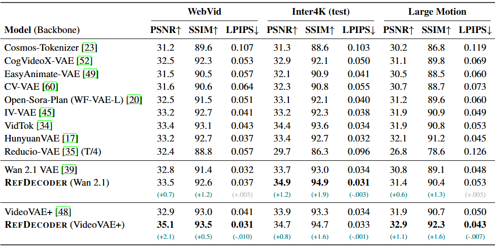
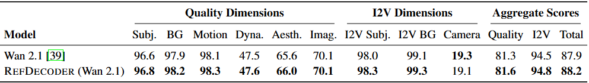

# RefDecoder

Reference-conditioned video VAE decoding for high-fidelity video reconstruction and generation.

[Project Page](https://refdecoder.github.io/) | [🤗 HuggingFace](https://huggingface.co/Arrokothwhi/RefDecoder) | [arXiv](https://arxiv.org/abs/0000.00000)

RefDecoder is a training and inference framework for adding reference-frame conditioning to video autoencoders. It is designed around two backbones:

- **Wan2.1 VAE**: a RefDecoder path built on the Wan2.1 image-to-video VAE decoder.
- **VideoVAE+**: a RefDecoder path built on a 2+1D VideoVAE+ autoencoder.

The repository focuses on reconstruction, finetuning, and video generation workflows that replace the original VAE decoder with RefDecoder..

## News

- Checkpoints will be released on Hugging Face. See [Model Download](#model-download) for placeholders.
- Training and inference configs are provided for both Wan2.1 VAE and VideoVAE+ backbones.

## Contributions

- **Reference-conditioned decoding**: RefDecoder injects a selected reference frame into the decoder so the reconstruction and generation can preserve appearance and identity cues across the video.
- **Backbone-compatible design**: the same training and inference entry points support both Wan2.1 VAE and VideoVAE+ variants.
- **Decoder-focused finetuning**: the configs freeze large parts of the pretrained autoencoder and train the reference modules, decoder-side transformer blocks, and selected decoder parameters.
- **Training and video generation utilities**: the repo includes Lightning/DeepSpeed training, image logging, reconstruction metrics, and VBench-oriented generation examples.

## Project Structure

```text
RefDecoder/
├── train.py                         # PyTorch Lightning training entry point
├── inference_video.py               # Reconstruction inference for .mp4 folders
├── configs/
│   ├── train/
│   │   ├── config_wan.yaml
│   │   └── config_videovaeplus.yaml
│   └── inference/
│       ├── eval_wan.yaml
│       └── eval_videovaeplus.yaml
├── src/models/Wan/                  # Wan2.1 VAE RefDecoder modules
├── src/models/VideoVAEPlus/         # VideoVAE+ RefDecoder modules
├── data/                            # CSV-based video dataset and Lightning datamodule
├── scripts/
│   ├── run_train.sh
│   └── run_inference.sh
└── VBench_example/                  # Example VBench video generation workflow
```

## Quickstart

### 1. Install

This project expects Python 3.10 and CUDA-capable PyTorch. The included `pyproject.toml` pins the main dependencies, including `torch==2.7.0`.

```bash
git clone https://github.com/RefDecoder/RefDecoder.git
cd RefDecoder

pip install -U uv
uv sync
source .venv/bin/activate
```

If you do not use `uv`, create a Python 3.10 environment and install the package manually:

```bash
pip install -e .
```

You also need a working FFmpeg/libx264 setup because inference writes reconstructed videos with `torchvision.io.write_video`.

### 2. Download Checkpoints

#### Model Download

| Model | File | Notes |
| --- | --- | --- |
| RefDecoder-Wan | `VAE/Wan2.1/wan2.1_ref.pt` | Wan2.1 VAE based RefDecoder checkpoint |
| RefDecoder-VideoVAEPlus | `VAE/VideoVAEPlus/videovaeplus_ref.pt` | VideoVAE+ based RefDecoder checkpoint |

Download both checkpoints at once with the Hugging Face CLI:

```bash
huggingface-cli download Arrokothwhi/RefDecoder --local-dir ckpt/RefDecoder
```

Or in Python:

```python
from huggingface_hub import snapshot_download

snapshot_download(repo_id="Arrokothwhi/RefDecoder", local_dir="ckpt/RefDecoder")
```

Expected layout:

```text
ckpt/
├── RefDecoder/
│   └── VAE/
│       ├── Wan2.1/
│       │   └── wan2.1_ref.pt
│       └── VideoVAEPlus/
│           └── videovaeplus_ref.pt
└── VideoVAEPlus/
    └── sota-4-16z.ckpt
```

Additional base-model requirements:

- The Wan path initializes its base VAE from `Wan-AI/Wan2.1-I2V-14B-480P-Diffusers`, subfolder `vae`. Make sure the Hugging Face model is accessible or already cached.
- The VideoVAE+ path currently loads `ckpt/VideoVAEPlus/sota-4-16z.ckpt` during model initialization. Place that base checkpoint at the path above, or update the path in `src/models/VideoVAEPlus/videovaeplus_ref0conv.py`.

### 3. Prepare Data

Training uses a CSV file with at least one column named `path`.

```csv
path
/absolute/path/to/video_0001.mp4
/absolute/path/to/video_0002.mp4
```

Supported media extensions include `avi`, `mp4`, `webm`, `mov`, `mkv`, `jpg`, `jpeg`, `png`, `bmp`, and `tiff`.

The dataset loader samples clips from each video, resizes them to the configured resolution, normalizes frames to `[-1, 1]`, and returns tensors shaped as `[C, T, H, W]`.

## Training

Choose one of the provided training configs:

- `configs/train/config_wan.yaml`
- `configs/train/config_videovaeplus.yaml`

Before training, set `data.params.train.params.csv_file` and `data.params.validation.params.csv_file` in the config, or override them from the command line.

Single-node training example:

```bash
torchrun --nproc_per_node=8 --nnodes=1 --master_port=16700 train.py \
  --base configs/train/config_wan.yaml \
  -t \
  --name RefDecoder-Wan \
  --logdir ./debug \
  data.params.train.params.csv_file=/path/to/train.csv \
  data.params.validation.params.csv_file=/path/to/val.csv \
  lightning.trainer.devices=8
```

The helper script expects the config name without `.yaml`:

```bash
bash scripts/run_train.sh config_wan 8
bash scripts/run_train.sh config_videovaeplus 8
```

Training outputs are written under `--logdir` and include Lightning checkpoints, logs, image logs, and WandB logs if the logger is enabled in the config.

### Training Requirements

For both backbones:

- A CSV dataset with readable video or image paths.
- CUDA GPUs with enough memory for the configured resolution, frame count, batch size, and number of decoder transformer layers.
- `pytorch-lightning`, `deepspeed`, `decord`, `torchvision`, `lpips`, `xformers`, and the other dependencies in `pyproject.toml`.
- Optional WandB access if using the default `WandbLogger`.

Wan config defaults:

- Resolution: `480 x 832`
- Clip length: `5` frames
- Target FPS: `15`
- Batch size: `2`
- DeepSpeed ZeRO stage 1
- Encoder and quant-conv frozen; decoder-side reference path and transformer modules trained

VideoVAE+ config defaults:

- Resolution: `216 x 216`
- Clip length: `4` frames for training
- Target FPS: `7.5`
- Batch size: `4`
- DeepSpeed ZeRO stage 1
- Pretrained VideoVAE+ base checkpoint required at `ckpt/VideoVAEPlus/sota-4-16z.ckpt`

## Inference

Inference reconstructs every `.mp4` file in `--data_root` and writes reconstructed videos to `--out_root`.

Before running inference, set `model.params.ckpt_path` in the corresponding inference config:

- `configs/inference/eval_wan.yaml`
- `configs/inference/eval_videovaeplus.yaml`

Wan example:

```bash
bash scripts/run_inference.sh eval_wan \
  /path/to/input_videos \
  outputs/wan \
  17 \
  480 \
  832 \
  cuda:0
```

VideoVAE+ example:

```bash
bash scripts/run_inference.sh eval_videovaeplus \
  /path/to/input_videos \
  outputs/videovaeplus \
  16 \
  216 \
  216 \
  cuda:0
```

You can also call the Python entry point directly:

```bash
python inference_video.py \
  --config_path configs/inference/eval_wan.yaml \
  --data_root /path/to/input_videos \
  --out_root outputs/wan \
  --model_type wan \
  --chunk_size 17 \
  --resolution 480 832 \
  --ref_frame_idx 0 \
  --device cuda:0
```

### Inference Requirements

- Input videos must be `.mp4` files when using `inference_video.py`.
- The configured RefDecoder checkpoint must be available through `model.params.ckpt_path`.
- The base checkpoint/model required by the selected backbone must also be available.
- Chunk size must match the backbone:
  - Wan: `chunk_size % 4 == 1`, maximum `17`. Valid examples: `1`, `5`, `9`, `13`, `17`.
  - VideoVAE+: `chunk_size % 4 == 0`, maximum `16`. Valid examples: `4`, `8`, `12`, `16`.
- `--ref_frame_idx` selects the reference frame from the original input video. The default is `0`.

## Checkpoint Notes

Lightning/DeepSpeed checkpoints are supported. The model loading code accepts checkpoints with a top-level `state_dict`, a top-level `module`, or a plain state dict, and strips common wrapper prefixes such as `_forward_module.` and `_orig_mod.`.

For training resume, use:

```bash
python train.py --base <config.yaml> -t --auto_resume --name <experiment> --logdir <log_root>
```

`--auto_resume` searches the experiment work directory for the latest full-info checkpoint.

## Video Generation

The repository includes an example image-to-video usage in `VBench_example/`. The workflow first generates Wan2.1 latents for VBench prompts and reference images, then decodes the same latents with either RefDecoder or the original Wan VAE decoder.

```text
VBench_example/generate_wan_latents_vbench.py
VBench_example/decode_refdecoder_vbench.py
VBench_example/decode_wanvae_vbench.py
```

Example latent generation:

```bash
python VBench_example/generate_wan_latents_vbench.py \
  --vbench_info_path /path/to/VBench/vbench2_beta_i2v/vbench2_i2v_full_info.json \
  --image_folder /path/to/VBench/vbench2_beta_i2v/data/crop/16-9 \
  --output_dir outputs/vbench/wan2.1_480p_latents \
  --samples_per_prompt 5 \
  --device cuda:0
```

Decode the generated latents with RefDecoder:

```bash
python VBench_example/decode_refdecoder_vbench.py \
  --config_path configs/inference/eval_wan.yaml \
  --latent_dir outputs/vbench/wan2.1_480p_latents \
  --image_folder /path/to/VBench/vbench2_beta_i2v/data/crop/16-9 \
  --output_dir outputs/vbench/refdecoder_480p_videos \
  --device cuda:0
```

Decode the same latents with the original Wan VAE baseline:

```bash
python VBench_example/decode_wanvae_vbench.py \
  --latent_dir outputs/vbench/wan2.1_480p_latents \
  --output_dir outputs/vbench/wanvae_480p_videos \
  --device cuda:0
```

For multi-GPU runs, launch one process per GPU and set `--rank` and `--world_size` so each process handles a different slice of the VBench examples.

## Results

We report RefDecoder against the original VAE decoders in reconstruction and image-to-video generation settings. The table screenshots should be placed under `assets/results/`.

### Reconstruction Quality



### VBench Image-to-Video Quality



## Acknowledgements

This project builds on the Wan2.1 VAE ecosystem and VideoVAE+ style video autoencoders. The README structure is adapted from the Wan2.1 project README while focusing on this repository's reference-conditioned reconstruction pipeline.

## License

See [LICENSE](LICENSE).
